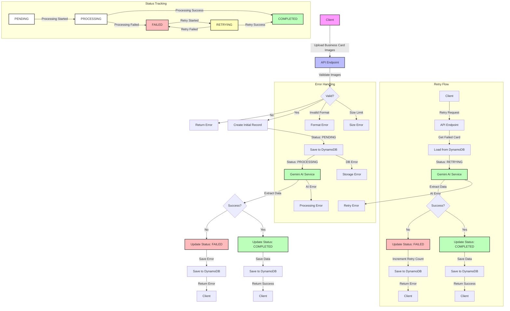

```mermaid
graph TD
    A[Client] -->|Upload Business Card Images| B[API Endpoint]
    B -->|Validate Images| C{Valid?}
    C -->|No| D[Return Error]
    C -->|Yes| E[Create Initial Record]
    E -->|Status: PENDING| F[Save to DynamoDB]
    F -->|Status: PROCESSING| G[Gemini AI Service]
    G -->|Extract Data| H{Success?}
    H -->|No| I[Update Status: FAILED]
    I -->|Save Error| J[Save to DynamoDB]
    J -->|Return Error| K[Client]
    H -->|Yes| L[Update Status: COMPLETED]
    L -->|Save Data| M[Save to DynamoDB]
    M -->|Return Success| N[Client]

    subgraph "Retry Flow"
        O[Client] -->|Retry Request| P[API Endpoint]
        P -->|Get Failed Card| Q[Load from DynamoDB]
        Q -->|Status: RETRYING| R[Gemini AI Service]
        R -->|Extract Data| S{Success?}
        S -->|No| T[Update Status: FAILED]
        T -->|Increment Retry Count| U[Save to DynamoDB]
        U -->|Return Error| V[Client]
        S -->|Yes| W[Update Status: COMPLETED]
        W -->|Save Data| X[Save to DynamoDB]
        X -->|Return Success| Y[Client]
    end

    subgraph "Status Tracking"
        Z1[PENDING] -->|Processing Started| Z2[PROCESSING]
        Z2 -->|Processing Failed| Z3[FAILED]
        Z2 -->|Processing Success| Z4[COMPLETED]
        Z3 -->|Retry Started| Z5[RETRYING]
        Z5 -->|Retry Failed| Z3
        Z5 -->|Retry Success| Z4
    end

    subgraph "Error Handling"
        C -->|Invalid Format| D1[Format Error]
        C -->|Size Limit| D2[Size Error]
        G -->|AI Error| D3[Processing Error]
        F -->|DB Error| D4[Storage Error]
        R -->|AI Error| D5[Retry Error]
    end

    style A fill:#f9f,stroke:#333,stroke-width:2px
    style B fill:#bbf,stroke:#333,stroke-width:2px
    style G fill:#bfb,stroke:#333,stroke-width:2px
    style R fill:#bfb,stroke:#333,stroke-width:2px
    style I fill:#fbb,stroke:#333,stroke-width:2px
    style T fill:#fbb,stroke:#333,stroke-width:2px
    style L fill:#bfb,stroke:#333,stroke-width:2px
    style W fill:#bfb,stroke:#333,stroke-width:2px
    style Z1 fill:#fff,stroke:#333,stroke-width:2px
    style Z2 fill:#fff,stroke:#333,stroke-width:2px
    style Z3 fill:#fbb,stroke:#333,stroke-width:2px
    style Z4 fill:#bfb,stroke:#333,stroke-width:2px
    style Z5 fill:#ffb,stroke:#333,stroke-width:2px
``` 